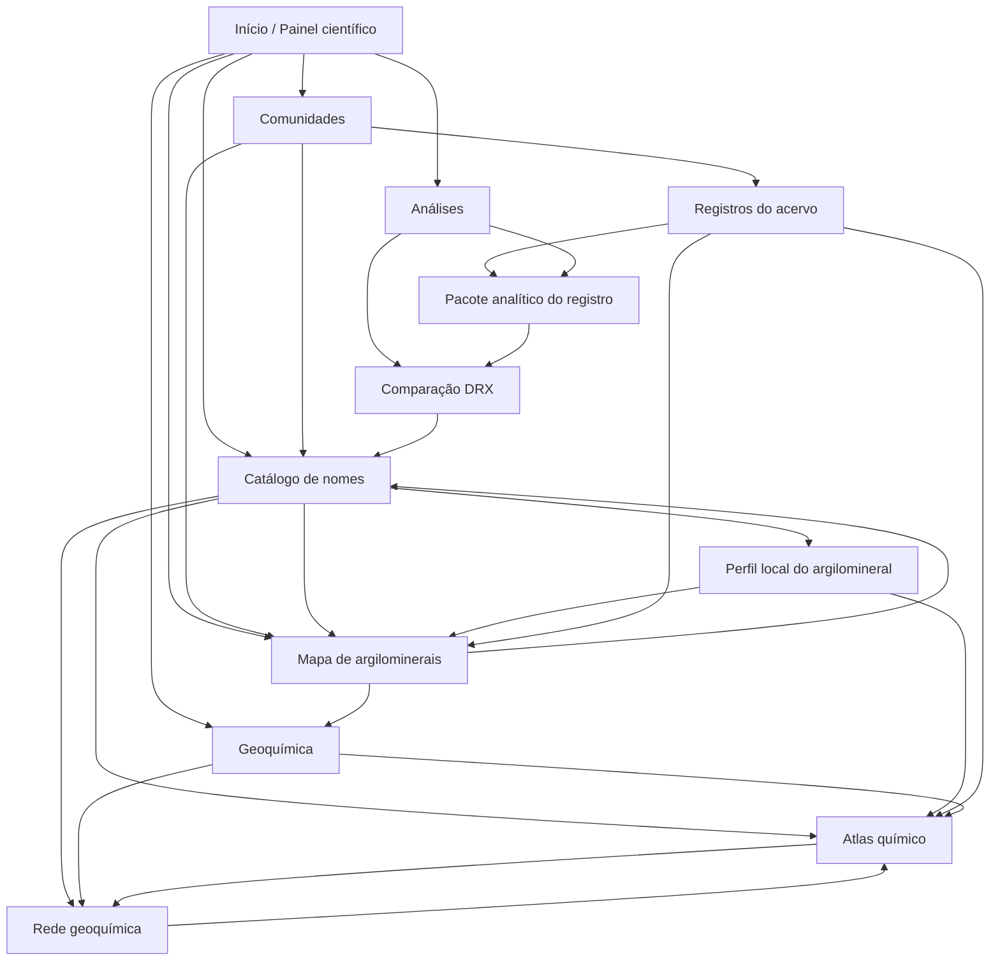

# Auditoria UX da Argiloteca

Data da auditoria: 2026-05-20  
Escopo: comunidades, mapa, catálogo autorizado, geoquímica, DRX e análises.

## Resumo executivo

A Argiloteca já possui módulos científicos ricos e semanticamente coerentes, mas a experiência ainda funciona como um conjunto de ilhas: cada página resolve bem uma tarefa local, enquanto a navegação global, os padrões de cabeçalho, a terminologia dos módulos e a entrada para usuários iniciantes ainda não formam um sistema único.

O principal achado é que as páginas científicas criadas sob o namespace `argiloteca` usam padrões próprios de layout, navegação por botões e estados de carregamento, enquanto `/communities/` permanece mais próxima do padrão InvenioRDM. Isso cria uma ruptura perceptível entre "repositório", "vocabulário científico", "mapa", "geoquímica" e "pacotes analíticos".

Os módulos mais fortes hoje são o mapa, o catálogo, a rede geoquímica e o atlas de composição global, pois já possuem ligações cruzadas e linguagem científica explícita. O ponto mais crítico é `/analises/`: a rota de entrada solicitada não aparece como índice geral; a implementação existente é `/analises/<record_id>`, voltada a um pacote analítico de registro específico. Para um usuário que deseja começar por análises, isso é uma barreira de descoberta.

Recomendação central: criar uma camada de navegação científica padronizada, com cabeçalho comum, breadcrumbs consistentes, páginas de entrada por módulo e CTAs contextuais. A experiência deve organizar a Argiloteca em cinco eixos: Acervo, Vocabulário, Território, Geoquímica e Análises. Comunidades devem funcionar como porta de entrada para coleções temáticas; Catálogo como autoridade terminológica; Mapa como navegação espacial; Geoquímica como interpretação composicional; DRX e Pacotes Analíticos como evidência laboratorial.

## Metodologia da análise

A análise combinou:

- Inspeção das rotas Flask/Invenio em `argiloteca/argiloteca_custom/argiloteca/views.py`.
- Leitura dos templates de páginas científicas em `argiloteca/argiloteca_custom/argiloteca/templates/semantic-ui/argiloteca/`.
- Leitura do componente compartilhado do mapa em `argiloteca/argiloteca_custom/argiloteca/templates/semantic-ui/argilo_map_components.html`.
- Leitura dos estilos específicos em `argiloteca/argiloteca_custom/argiloteca/static/css/`.
- Verificação do cabeçalho, breadcrumbs e base de comunidades em `argiloteca/templates/semantic-ui/invenio_app_rdm/`, `argiloteca/templates/semantic-ui/invenio_theme/` e `argiloteca/templates/semantic-ui/invenio_communities/`.
- Tentativa de acesso local às URLs em `https://127.0.0.1:5443`.

Limitação de ambiente: havia um processo escutando na porta `5443`, mas as requisições locais retornaram sem resposta HTTP utilizável, e o navegador integrado bloqueou a navegação local com `net::ERR_BLOCKED_BY_CLIENT`. Assim, a avaliação visual foi inferida a partir do código-fonte, padrões de layout e histórico técnico recente do projeto, não por captura de tela atual. Essa limitação deve ser revalidada em uma rodada posterior com a aplicação renderizando corretamente.

## Visão geral do projeto

A Argiloteca está estruturada como uma customização InvenioRDM com páginas científicas adicionais expostas por blueprint próprio. As páginas avaliadas combinam três camadas:

- Camada InvenioRDM: comunidades, busca, registros, cabeçalho global, autenticação e breadcrumbs.
- Camada científica Argiloteca: catálogo autorizado, mapa, rede geoquímica, atlas geoquímico, DRX e pacote analítico.
- Camada de dados e APIs: snapshots de mapa/geoquímica, endpoints de DRX, endpoints de pacotes analíticos e endpoints de registro.

Rotas centrais identificadas:

- `/catalogo-autorizado-de-nomes-para-argilominerais`
- `/mapa-argilominerais`
- `/argiloteca/pontos`
- `/argiloteca/mineracao/areas`
- `/geoquimica/rede`
- `/geoquimica/composicao-global`
- `/drx/comparacao`
- `/analises/<record_id>`
- `/api/argiloteca/analises/<record_id>`
- `/api/argiloteca/drx/registros`
- `/api/argiloteca/geoquimica/rede`
- `/api/argiloteca/geoquimica/agregada`

Observação crítica: não foi encontrada rota de página para `/analises/` como índice. A página existente depende de um `record_id`.

## Inventário das páginas avaliadas

| Página | Tipo | Evidência de implementação | Papel atual |
|---|---|---|---|
| `/communities/` | InvenioRDM | Templates base em `invenio_communities/base.html` e fixtures de comunidades | Entrada por comunidades/coleções, mas com menor integração visual aos módulos científicos. |
| `/mapa-argilominerais` | Página científica | `mapa_argilominerais.html` + `argilo_map_components.html` | Exploração territorial de registros, pontos, amostras, argilominerais e áreas ANM/SIGMINE. |
| `/catalogo-autorizado-de-nomes-para-argilominerais` | Página científica | `catalogo_autorizado_argilominerais.html` | Autoridade terminológica e referência local para argilominerais. |
| `/geoquimica/rede` | Página científica | `geoquimica_rede.html`, `geoquimica-rede.css/js` | Rede explicável de analogias geoquímicas. |
| `/geoquimica/composicao-global` | Página científica | `geoquimica_agregada.html`, `geoquimica-agregada.css/js` | Atlas de composição química global com filtros, gráficos e tabela consolidada. |
| `/drx/comparacao` | Página analítica | `drx_comparacao.html`, `drx-comparacao.css/js` | Comparação de difratogramas e arquivos RAW. |
| `/analises/` | Ausente como índice | Só existe `/analises/<record_id>` | Deveria ser porta de entrada analítica; hoje funciona apenas por contexto de registro. |
| `/analises/<record_id>` | Página analítica contextual | `pacote_analitico.html`, `pacote-analitico.css/js` | Pacote analítico rastreável de um registro específico. |

## Diagnóstico geral de UX

### Pontos fortes

- O projeto já possui vocabulário científico consistente em vários pontos: argilomineral, grupo mineralógico, amostra, registro, composição global, DRX e analogia geoquímica.
- Há navegação cruzada entre mapa, catálogo, rede, atlas e DRX nos headers locais.
- O mapa já usa uma abordagem madura para filtros aplicados por botão, camada ANM/SIGMINE, estatísticas laterais e legenda.
- A geoquímica já separa filtros científicos principais de parâmetros técnicos avançados.
- O pacote analítico traz fluxo claro Registro -> Análises -> Comparação.
- O catálogo cumpre papel de fonte terminológica local e possui links para páginas de argilominerais.

### Problemas sistêmicos

| Problema | Impacto | Gravidade | Recomendação |
|---|---|---|---|
| Headers científicos divergentes entre módulos | Usuário precisa reaprender a navegação a cada página | Alta | Criar um componente comum de cabeçalho científico. |
| Falta de índice `/analises/` | Usuário não consegue entrar no módulo analítico sem conhecer um registro | Alta | Criar página de entrada "Análises" com cards para DRX, Geoquímica, registros com pacotes e comparação. |
| Breadcrumbs pouco explorados nas páginas customizadas | Baixa percepção de localização | Média | Adicionar breadcrumbs explícitos em todas as páginas científicas. |
| Botões de navegação usam rótulos curtos em caixa alta | Boa densidade, mas pouca clareza para iniciantes | Média | Usar rótulos mistos: "Mapa", "Catálogo", "Rede geoquímica", "Atlas químico", "DRX". |
| Estilos locais duplicam padrões de card, painel, botão, tabela e filtro | Aumenta custo de manutenção e inconsistência visual | Média | Consolidar tokens e componentes em um CSS base da Argiloteca. |
| Estados vazios/carregando variam por módulo | Menor previsibilidade | Média | Padronizar mensagens com causa, ação e rota alternativa. |
| Páginas científicas não parecem pertencer ao mesmo "produto" que comunidades | Ruptura entre acervo Invenio e exploração científica | Alta | Criar navegação contextual e cards relacionados em comunidades e registros. |

## Diagnóstico página por página

### 1. `/communities/`

Objetivo atual: listar ou acessar comunidades InvenioRDM.

Diagnóstico:

- A página provavelmente herda padrões InvenioRDM e não o padrão visual das páginas científicas.
- As comunidades da Argiloteca têm valor científico forte, mas a experiência padrão de comunidades pode parecer administrativa ou genérica.
- Há risco de o usuário não entender que comunidades são conjuntos temáticos, grupos mineralógicos ou coleções curatoriais.

Problemas:

| Componente | Problema | Impacto | Gravidade | Recomendação | Esforço | Arquivos prováveis |
|---|---|---|---|---|---|---|
| Lista de comunidades | Baixa conexão com mapa, catálogo e análises | Comunidade vira destino isolado | Alta | Adicionar intro científica "Explore conjuntos curatoriais da Argiloteca" e cards relacionados | Médio | `argiloteca/templates/semantic-ui/invenio_communities/base.html`, templates de lista de comunidades |
| Cards de comunidade | Possível falta de metadados científicos visíveis | Usuário não sabe o recorte da comunidade | Média | Exibir grupo mineralógico, número de registros, link para mapa filtrado e catálogo | Médio | Templates de comunidades, `app_data/data/communities.yaml` |
| Navegação | Sem breadcrumbs científicos | Menor orientação | Média | Breadcrumb: Início > Acervo > Comunidades | Baixo | `invenio_theme/breadcrumbs.html` ou bloco local |

Exemplo de CTA:

- `Ver registros desta comunidade`
- `Ver argilominerais no catálogo`
- `Explorar no mapa`

### 2. `/mapa-argilominerais`

Objetivo atual: visualizar distribuição espacial de registros e ocorrências de argilominerais.

Diagnóstico:

- Usa macro compartilhada `render_argilo_atlas_panel`, com ações para Mapa, Catálogo, Rede, Composição e tela cheia.
- Possui filtros por argilomineral, perfil do registro e camada minerária ANM/SIGMINE.
- O padrão de botão "Atualizar dados" é correto para evitar recarregamentos automáticos inesperados.
- O cabeçalho do mapa usa `h3` na macro principal, enquanto outras páginas usam `h1`. Isso prejudica hierarquia semântica.

Problemas:

| Componente | Problema | Impacto | Gravidade | Recomendação | Esforço | Arquivos prováveis |
|---|---|---|---|---|---|---|
| Cabeçalho | Título principal renderizado como `h3` | Hierarquia semântica inconsistente | Média | Usar `h1` visualmente controlado no atlas do mapa | Baixo | `argilo_map_components.html` |
| Navegação local | Botões curtos e diferentes dos outros módulos | Menor clareza para iniciantes | Média | Padronizar rótulos: Mapa, Catálogo, Rede geoquímica, Atlas químico | Baixo | `argilo_map_components.html` |
| Filtros | "Perfil do registro" exige leitura da ajuda | Carga cognitiva | Média | Renomear para "Composição química global" com opções "Todos", "Com composição", "Sem composição" | Baixo | `argilo_map_components.html` |
| Legenda | Boa, mas poderia conectar cor ao comportamento | Usuário entende o símbolo, mas não o clique | Baixa | Acrescentar microtexto: "Clique nos pontos para abrir registros e amostras agrupadas" | Baixo | `argilo_map_components.html` |

### 3. `/catalogo-autorizado-de-nomes-para-argilominerais`

Objetivo atual: apresentar nomenclatura autorizada e fontes de referência.

Diagnóstico:

- É uma das páginas conceitualmente mais importantes do sistema.
- Possui hero textual, fontes de referência, seletor de argilomineral e lista com cards.
- O catálogo tem navegação para mapa, catálogo, rede e composição, mas não inclui DRX nem análises.
- O seletor "Argilomineral" leva ao perfil local por `/argilominerais`.

Problemas:

| Componente | Problema | Impacto | Gravidade | Recomendação | Esforço | Arquivos prováveis |
|---|---|---|---|---|---|---|
| Título/introdução | Muito texto antes da lista | Usuário orientado à busca demora a agir | Média | Colocar busca/seleção logo abaixo do título e fontes em bloco recolhível | Médio | `catalogo_autorizado_argilominerais.html` |
| Navegação | Não inclui "Análises" ou "DRX" como vínculo terminológico | Catálogo não funciona como referência transversal | Média | Adicionar links "Comparar DRX por mineral" e "Ver registros analíticos" | Médio | Template do catálogo + endpoints DRX |
| Cards | Tags mostram comunidade, grupo e classe, mas faltam CTAs contextuais | Usuário precisa abrir detalhe para seguir | Baixa | Cards com "Ver no mapa", "Ver geoquímica", "Abrir perfil" | Baixo | `catalogo_autorizado_argilominerais.html` |
| Terminologia | Título da página é longo para menu | Menu fica pesado | Baixa | Menu: "Catálogo de nomes"; título completo mantido no conteúdo | Baixo | Menu/config ou headers locais |

### 4. `/geoquimica/rede`

Objetivo atual: explorar analogias geoquímicas entre registros.

Diagnóstico:

- A página é densa e cientificamente rica.
- O layout em filtros, grafo, detalhes, legenda, comparação e agrupamentos é adequado para uso avançado.
- O modo de análise e filtros científicos aparecem antes dos parâmetros técnicos, o que é uma boa decisão.
- A ação "Tela cheia" e cores por grupo mineralógico fortalecem a leitura visual.

Problemas:

| Componente | Problema | Impacto | Gravidade | Recomendação | Esforço | Arquivos prováveis |
|---|---|---|---|---|---|---|
| Objetivo da página | "Rede de Analogias Geoquímicas" pode ser abstrato para iniciantes | Usuário não sabe o que uma aresta significa | Média | Subtítulo: "Compare registros por semelhança química, mineralógica e contextual" | Baixo | `geoquimica_rede.html` |
| Filtros | Muitos controles visíveis | Carga cognitiva alta | Média | Agrupar em "Composição", "Contexto geológico", "Analogia" | Médio | `geoquimica_rede.html`, CSS |
| Labels | "nome argilomineral" inicia com minúscula | Inconsistência textual | Baixa | "Argilomineral" | Baixo | `geoquimica_rede.html` |
| Grafo | `div` com aria-label, mas sem alternativa textual inicial | Acessibilidade parcial | Alta | Manter tabela/lista equivalente de nós/arestas filtrados com foco por teclado | Alto | `geoquimica_rede.html/js` |
| Estados | "Carregando rede geoquimica..." sem acento | Qualidade textual | Baixa | "Carregando rede geoquímica..." | Baixo | `geoquimica_rede.html/js` |

### 5. `/geoquimica/composicao-global`

Objetivo atual: explorar composição química global com indicadores, gráficos e tabela consolidada.

Diagnóstico:

- A página tem estrutura clara: cabeçalho, cards estatísticos, filtros, gráfico de barras, radar e tabela.
- O foco em argilomineral na tabela está alinhado à necessidade científica do projeto.
- O filtro "Apenas registros com amostra" tem opção "Sim", mas não "Não"; isso limita a exploração de lacunas.

Problemas:

| Componente | Problema | Impacto | Gravidade | Recomendação | Esforço | Arquivos prováveis |
|---|---|---|---|---|---|---|
| Filtro de amostra | Só oferece "Todos" e "Sim" | Não permite auditar registros sem amostra | Média | Adicionar opção "Sem amostra vinculada" se API aceitar `has_sample=false` | Médio | `geoquimica_agregada.html`, `views.py`, JS |
| Gráficos | Barras e radar não indicam metodologia no primeiro olhar | Usuário pode interpretar média sem critério | Média | Exibir nota curta: média por recorte, N de registros e óxidos usados | Baixo | `geoquimica-agregada.js/html` |
| Tabela | Pode ficar larga no celular | Responsividade e leitura | Média | Adicionar modo mobile com linhas em cards ou colunas prioritárias | Médio | CSS/JS |
| Navegação | Linka DRX, mas não "Análises" como índice | Conexão analítica incompleta | Média | Adicionar CTA "Ver pacotes analíticos" quando existir índice | Baixo após criar `/analises/` | `geoquimica_agregada.html` |

### 6. `/drx/comparacao`

Objetivo atual: comparar difratogramas associados a registros, pacotes ou arquivos externos.

Diagnóstico:

- A página é funcionalmente ambiciosa: modos de visualização, upload temporário, seleção de RAW, picos, CSV/PDF, painel mineralógico.
- O cabeçalho é diferente das páginas de geoquímica: não usa hero colorido, tem escala tipográfica própria.
- A lista de ações na toolbar é longa e pode ser difícil em telas pequenas.
- Há labels de exportação muito curtos: "CSV", "PDF".

Problemas:

| Componente | Problema | Impacto | Gravidade | Recomendação | Esforço | Arquivos prováveis |
|---|---|---|---|---|---|---|
| Entrada sem contexto | Página pode abrir sem registro e pedir dois difratogramas | Usuário iniciante não sabe onde buscar | Alta | Estado inicial com busca de registros DRX e explicação operacional curta | Médio | `drx_comparacao.html/js` |
| Toolbar | Muitas ações no mesmo nível | Carga cognitiva | Média | Separar em grupos: Seleção, Visualização, Exportação | Médio | `drx_comparacao.html/css` |
| Upload externo | "Comparar RAW externo" pode parecer importação permanente | Risco de expectativa errada | Média | Rótulo: "Comparar RAW temporário" e ajuda "não será salvo" | Baixo | `drx_comparacao.html/js` |
| Acessibilidade do gráfico SVG | `role=img` existe, mas alternativa tabular não é clara | Usuário de leitor de tela perde dados | Alta | Exibir tabela resumida dos difratogramas selecionados e picos | Médio | `drx_comparacao.html/js` |

### 7. `/analises/` e `/analises/<record_id>`

Objetivo esperado: entrada para módulos analíticos.  
Objetivo implementado: pacote analítico de um registro específico.

Diagnóstico:

- `/analises/<record_id>` é conceitualmente forte e tem fluxo Registro -> Análises -> Comparação.
- `/analises/` não foi encontrada como página índice.
- Sem índice, o usuário precisa vir de um registro específico ou de DRX com contexto.

Problemas:

| Componente | Problema | Impacto | Gravidade | Recomendação | Esforço | Arquivos prováveis |
|---|---|---|---|---|---|---|
| Rota `/analises/` | Ausente | Quebra expectativa e objetivo do módulo | Alta | Criar página índice "Análises" | Médio | `views.py`, novo `analises_index.html` |
| Pacote analítico | H1 inclui título do registro e pode ficar longo | Quebra visual em registros com título extenso | Média | Separar H1 "Pacote analítico" e título em subtítulo/metadata | Baixo | `pacote_analitico.html/css` |
| Tabela | Cabeçalhos técnicos como `peaks_two_theta` e `peaks_d` | Linguagem pouco amigável | Média | "Picos 2θ" e "Espaçamentos d" | Baixo | `pacote_analitico.html/js` |
| Workflow | Etapa 3 "Comparação" não é link visual claro | Fluxo parece decorativo | Baixa | Tornar etapas clicáveis quando houver destino | Baixo | `pacote_analitico.html` |

## Mapa de relacionamento entre páginas



Links cruzados recomendados:

- Comunidade -> Catálogo filtrado por grupo mineralógico.
- Comunidade -> Mapa filtrado por argilominerais do grupo.
- Comunidade -> Registros da comunidade.
- Catálogo -> Mapa com `mineral_term`.
- Catálogo -> Atlas geoquímico com argilomineral.
- Catálogo -> DRX com filtro de argilomineral, quando houver dados.
- Mapa -> Catálogo do argilomineral selecionado no popup.
- Mapa -> Atlas/Rede preservando argilomineral filtrado.
- Atlas -> Rede com filtros equivalentes.
- Rede -> Atlas com registro ou argilomineral selecionado.
- Registro -> Pacote analítico quando houver `arg:analises`.
- Pacote analítico -> Comparação DRX.
- DRX -> Perfil do argilomineral candidato no catálogo.

## Proposta de arquitetura da informação

### Navegação principal sugerida

1. Acervo
   - Buscar registros
   - Comunidades
   - Submissão/depósito

2. Vocabulário
   - Catálogo de nomes
   - Perfis de argilominerais
   - Fontes terminológicas

3. Território
   - Mapa de argilominerais
   - Áreas ANM/SIGMINE
   - Registros georreferenciados

4. Geoquímica
   - Atlas químico
   - Rede geoquímica
   - Registros com composição global

5. Análises
   - Visão geral de análises
   - Pacotes analíticos
   - Comparação DRX
   - Métodos futuros

### Nomes mais claros para menus

| Nome atual | Nome recomendado em menu | Título de página recomendado |
|---|---|---|
| Comunidades | Comunidades | Comunidades da Argiloteca |
| Catálogo | Catálogo de nomes | Catálogo autorizado de nomes para argilominerais |
| Mapa | Mapa | Mapa de argilominerais |
| Rede | Rede geoquímica | Rede de analogias geoquímicas |
| Atlas | Atlas químico | Atlas geoquímico da Argiloteca |
| DRX | Comparação DRX | Comparação de difratogramas |
| Análises | Análises | Análises e pacotes analíticos |

### Página inicial ou painel de entrada

Recomenda-se um painel científico de entrada, que pode ser a home ou uma nova página `/explorar`, com seis cards:

- Comunidades: "Explore conjuntos curatoriais e coleções temáticas."
- Catálogo de nomes: "Consulte a nomenclatura autorizada."
- Mapa: "Veja registros e amostras no território."
- Geoquímica: "Compare composições e analogias entre registros."
- DRX: "Compare difratogramas e evidências mineralógicas."
- Análises: "Acesse pacotes analíticos vinculados aos registros."

## Proposta de navegação padronizada

### Cabeçalho científico comum

Cada página científica deve usar:

- Kicker: eixo do módulo, por exemplo `Geoquímica`, `Vocabulário`, `Território`, `Análises`.
- H1: nome claro da página.
- Subtítulo: tarefa principal e dados usados.
- Metadados curtos: registros, amostras, atualização ou fonte.
- Ações contextuais: no máximo 4 visíveis, demais em menu "Mais".

Estrutura recomendada:

```html
<header class="argilo-page-header">
  <nav class="argilo-breadcrumb">Início / Geoquímica / Atlas químico</nav>
  <p class="argilo-page-kicker">Geoquímica</p>
  <h1>Atlas químico</h1>
  <p>Explore composições globais por argilomineral, grupo mineralógico e amostra.</p>
  <nav class="argilo-module-nav" aria-label="Navegação entre módulos científicos">
    ...
  </nav>
</header>
```

### Breadcrumbs

Padrão:

- `Início > Acervo > Comunidades`
- `Início > Vocabulário > Catálogo de nomes`
- `Início > Território > Mapa de argilominerais`
- `Início > Geoquímica > Rede geoquímica`
- `Início > Geoquímica > Atlas químico`
- `Início > Análises > Comparação DRX`
- `Início > Registro > Análises > Pacote analítico`

### Botões e links

- Primário: ação que altera a visualização ou inicia tarefa principal, como `Atualizar rede`, `Atualizar painel`, `Comparar selecionados`.
- Secundário: navegação contextual, como `Abrir registro`, `Ver no mapa`.
- Terciário/link: ajuda, documentação, fonte externa.
- Exportação: grupo próprio, com rótulos `Exportar CSV` e `Exportar PDF`.
- Tela cheia: botão com ícone + texto ou tooltip, sempre com `aria-pressed`.

### Filtros

Padrão de filtros:

- Título do painel: `Filtros`
- Subgrupos: `Termo`, `Amostra`, `Composição`, `Contexto`, `Avançado`
- Botões: `Atualizar dados` e `Limpar filtros`
- Microtexto: apenas quando o campo for ambíguo, como ANM/SIGMINE ou composição global.

### Estados

Cada estado deve responder a três perguntas: o que aconteceu, por que talvez aconteceu, o que fazer.

Exemplo vazio:

> Nenhum registro encontrado para este recorte. Remova filtros ou consulte o catálogo para verificar nomes autorizados.

Exemplo erro:

> Não foi possível carregar a rede geoquímica. Tente atualizar os dados ou verifique se os snapshots foram regenerados.

## Recomendações de design system

### Tokens funcionais

Usar tokens compartilhados, evitando definições paralelas em cada CSS:

- `--arg-color-primary`: navegação científica principal.
- `--arg-color-primary-strong`: contraste de botões e headers.
- `--arg-color-surface`: fundo de painéis.
- `--arg-color-surface-analytic`: fundo de gráficos e mapas.
- `--arg-color-border`: linhas e divisórias.
- `--arg-color-text`: texto principal.
- `--arg-color-muted`: texto secundário.
- `--arg-color-map`: território/mapa.
- `--arg-color-geo`: geoquímica.
- `--arg-color-drx`: DRX/análises.
- `--arg-color-vocab`: catálogo/vocabulário.
- `--arg-color-warning`: lacunas/atenção.
- `--arg-color-error`: erros.

### Tipografia

- H1: 2.0rem a 2.4rem, sem depender de viewport width.
- H2 em painéis: 1.15rem a 1.35rem.
- Labels: 0.86rem a 0.92rem, peso 600.
- Tabelas: 0.88rem a 0.94rem, com números tabulares.
- Kicker: usar com moderação; caixa alta apenas em labels curtos.

### Componentes base

- `ArgiloPageHeader`
- `ArgiloModuleNav`
- `ArgiloBreadcrumb`
- `ArgiloFilterPanel`
- `ArgiloStatsGrid`
- `ArgiloDataBlock`
- `ArgiloScientificTable`
- `ArgiloEmptyState`
- `ArgiloLoadingState`
- `ArgiloErrorState`
- `ArgiloRelatedLinks`
- `ArgiloVisualizationToolbar`

### Cards

- Raio de 8px como padrão.
- Usar cards para itens repetidos, métricas e resultados.
- Evitar cards dentro de cards.
- Cada card científico deve ter: título, tipo de entidade, evidência/metadata, ação primária.

### Tabelas

- Cabeçalhos sempre em linguagem humana.
- Colunas numéricas alinhadas à direita.
- Unidades no cabeçalho: `SiO2 (%)`, `2θ`, `d (Å)`.
- Em celular: modo cards ou colunas prioritárias.
- Ação por linha sempre no final: `Abrir registro`, `Ver curva`, `Comparar`.

### Visualizações científicas

- Mapas: legenda sempre visível, filtros aplicados manualmente, popup com links para registro/catálogo/geoquímica.
- Redes: legenda de nós e arestas, alternativa tabular, detalhe explicável no clique.
- Gráficos geoquímicos: mostrar N, agregação usada e unidade.
- DRX: eixo com unidade, modo selecionado, lista de curvas, picos e tabela alternativa.

## Recomendações de acessibilidade

- Garantir um único `h1` por página científica.
- Associar todos os labels a inputs via `for`/`id`; alguns templates usam `<label>` sem associação explícita.
- Manter foco visível em botões customizados, especialmente botões do mapa e toolbar.
- Usar `aria-live="polite"` para status de carregamento, contagem de registros e erro.
- Adicionar alternativas textuais para grafo, mapa e SVG de DRX.
- Evitar depender apenas de cor para distinguir grupos, arestas, pontos ou picos.
- Usar `aria-pressed` em alternâncias: tela cheia, camada ANM/SIGMINE, mostrar picos.
- Evitar rótulos técnicos crus como `peaks_two_theta`.
- Garantir contraste mínimo AA em botões sobre headers com gradiente.

## Recomendações de responsividade

- Cabeçalhos com ações devem quebrar em duas linhas antes de comprimir texto.
- Toolbars longas devem virar grupos recolhíveis em telas menores que 760px.
- Painéis laterais de filtro devem ir para cima do conteúdo no mobile, com botão "Mostrar filtros".
- Tabelas grandes devem ter modo responsivo por cards ou colunas fixas prioritárias.
- Mapas e grafos devem ter altura mínima adaptada: desktop 640px, tablet 520px, celular 420px.
- Em DRX, controles de exportação devem ficar em menu secundário no celular.
- Evitar H1 com título de registro completo; usar quebra controlada e metadados abaixo.

## Avaliação por perfis de usuário

| Perfil | Necessidade principal | Experiência atual | Risco UX | Melhoria recomendada |
|---|---|---|---|---|
| Pesquisador em argilas e argilominerais | Relacionar mineralogia, composição, território e evidência analítica | Encontra informação rica, mas precisa conhecer os caminhos entre catálogo, mapa, geoquímica e DRX | Perder relações importantes entre módulos | Navegação contextual por argilomineral: catálogo -> mapa -> atlas -> rede -> DRX. |
| Curador de dados científicos | Auditar registros, lacunas, amostras, comunidades e terminologia | Tem bons dados estruturados, mas faltam painéis de lacuna e índices por módulo | Dificuldade para priorizar correções | Criar visão de curadoria com filtros por ausência de amostra, ausência de composição, sem coordenadas e sem comunidade. |
| Técnico ou analista de laboratório | Acessar pacote analítico, comparar DRX e verificar arquivos RAW | `/analises/<record_id>` é útil quando o registro é conhecido; `/analises/` não orienta a entrada | Dependência de link vindo de outro lugar | Criar índice de análises com busca por amostra, arquivo, preparação e registro. |
| Usuário iniciante | Entender o que é Argiloteca e por onde começar | Páginas científicas têm linguagem especializada e pouco onboarding | Sobrecarga conceitual | Painel de entrada com seis caminhos e descrições curtas: Acervo, Comunidades, Catálogo, Mapa, Geoquímica, Análises. |
| Usuário com tarefa rápida | Encontrar rapidamente um argilomineral, análise ou conjunto de dados | Catálogo resolve argilomineral; análises e comunidades dependem de contexto | Busca fragmentada | Busca transversal com atalhos: "Argilomineral", "Registro", "Amostra", "Comunidade", "Arquivo DRX". |

Implicação de produto: a Argiloteca precisa atender tanto usuários exploratórios quanto usuários orientados por tarefa. Para isso, cada página deve oferecer uma próxima ação clara e uma saída clara: abrir registro, ver no mapa, consultar termo, comparar análise ou voltar ao painel do módulo.

## Backlog priorizado de melhorias

| Prioridade | Página ou módulo | Problema | Recomendação | Impacto esperado | Esforço estimado | Arquivos prováveis | Observações |
|---|---|---|---|---|---|---|---|
| P0 | Análises | `/analises/` não existe como entrada | Criar índice de análises com busca de registros, cards DRX/Geoquímica e pacotes recentes | Usuário entende e acessa o módulo analítico sem record_id | Médio | `views.py`, novo `analises_index.html`, CSS base | Deve ser a porta de entrada para DRX e pacotes |
| P0 | Navegação global | Módulos científicos não aparecem como arquitetura unificada | Criar navegação científica comum | Reduz desorientação entre páginas | Médio | Header/base templates, novo componente/macro | Preservar rotas existentes |
| P0 | Comunidades | Comunidades pouco conectadas ao ecossistema científico | Adicionar CTAs para registros, mapa, catálogo e análises | Comunidades viram entrada temática real | Médio | Templates de comunidades, fixtures | Integrar com comunidades por grupo mineralógico |
| P1 | Todas páginas científicas | Headers e botões divergentes | Padronizar `ArgiloPageHeader` e `ArgiloModuleNav` | Coerência visual e funcional | Médio | Templates em `semantic-ui/argiloteca/`, CSS base | Primeiro implementar macro sem alterar dados |
| P1 | Todas páginas científicas | Ausência de breadcrumbs consistentes | Adicionar breadcrumbs por eixo | Usuário sabe onde está | Baixo | Templates ou macro comum | Compatível com Invenio breadcrumbs |
| P1 | DRX | Estado inicial sem orientação quando não há contexto | Incluir busca/lista de registros com DRX e estado vazio instrutivo | Melhora descoberta e reduz abandono | Médio | `drx_comparacao.html/js` | Pode usar `/api/argiloteca/drx/registros` |
| P1 | Geoquímica/rede | Grafo sem alternativa tabular equivalente | Adicionar tabela/lista de nós e relações filtradas | Acessibilidade e auditoria científica | Alto | `geoquimica_rede.html/js/css` | Importante para leitor de tela e validação |
| P1 | Mapa | H3 como título principal | Usar H1 no atlas do mapa | Hierarquia semântica correta | Baixo | `argilo_map_components.html` | Ajustar CSS para manter visual |
| P1 | Pacote analítico | H1 longo com título de registro | Separar H1 e metadados | Melhor responsividade | Baixo | `pacote_analitico.html/css` | Evita quebra feia em celular |
| P2 | Catálogo | Fontes ocupam muito espaço antes da lista | Tornar fontes recolhíveis ou mover após busca | Busca mais rápida | Médio | `catalogo_autorizado_argilominerais.html` | Manter rigor de fontes |
| P2 | Geoquímica/atlas | Filtro de amostra só permite "Sim" | Permitir "Sem amostra vinculada" | Ajuda curadoria de lacunas | Médio | `geoquimica_agregada.html/js`, `views.py` | Verificar contrato da API |
| P2 | DRX | Toolbar longa | Agrupar ações por Seleção, Visualização, Exportação | Menor carga cognitiva | Médio | `drx_comparacao.html/css` | Especialmente importante em mobile |
| P2 | Visualizações | Estados de erro/vazio não padronizados | Criar componentes `ArgiloEmptyState` e `ArgiloErrorState` | Experiência previsível | Baixo | JS/CSS compartilhado | Pode ser incremental |
| P2 | Tabelas | Cabeçalhos técnicos crus | Renomear para linguagem científica legível | Mais clareza | Baixo | `pacote_analitico.html/js` | Ex.: `Picos 2θ`, `Espaçamentos d` |
| P3 | Textos | Caixa alta em botões locais | Usar capitalização normal | Melhor legibilidade | Baixo | Templates científicos | Ex.: `Atlas químico`, não `ATLAS` |
| P3 | Catálogo/perfil | Erro textual "Licensa" | Corrigir para "Licença" | Polimento e credibilidade | Baixo | `argilomineral_detail.html` | Fora do escopo mínimo, mas visível |
| P3 | Cores | Paletas locais duplicadas | Consolidar tokens | Manutenção mais simples | Médio | CSS base e CSS módulos | Fazer após estabilizar header |

## Sugestões de implementação no código

1. Criar macro de cabeçalho científico:
   - Arquivo sugerido: `argiloteca/argiloteca_custom/argiloteca/templates/semantic-ui/argiloteca/_scientific_page.html`.
   - Exportar macros `render_scientific_header`, `render_module_nav`, `render_related_links`.

2. Criar CSS base:
   - Arquivo sugerido: `argiloteca/argiloteca_custom/argiloteca/static/css/argiloteca-scientific.css`.
   - Centralizar tokens e componentes comuns.
   - Importar antes dos CSS específicos.

3. Criar rota `/analises/`:
   - Em `views.py`, adicionar `@blueprint.route("/analises/", endpoint="analises_index")`.
   - Template: `semantic-ui/argiloteca/analises_index.html`.
   - Consumir `/api/argiloteca/drx/registros` para listar registros com DRX.

4. Padronizar rótulos:
   - `MAPA` -> `Mapa`
   - `CATÁLOGO` -> `Catálogo de nomes`
   - `REDE` -> `Rede geoquímica`
   - `ATLAS` -> `Atlas químico`
   - `DRX` -> `Comparação DRX`

5. Melhorar acessibilidade dos formulários:
   - Substituir labels sem `for` por pares `for`/`id`.
   - Adicionar `aria-describedby` para notas de ajuda.
   - Padronizar `aria-live` nos status.

6. Criar seção de páginas relacionadas:
   - No final de catálogo, mapa, rede, atlas, DRX e pacote analítico.
   - Cards pequenos: "Também relacionado".

7. Integrar comunidades:
   - Cards de comunidade devem apontar para mapa e catálogo filtrados.
   - A página de comunidade deve explicar se representa grupo mineralógico, coleção, fonte ou tema.

## Conclusão

A Argiloteca já possui substância científica e módulos tecnicamente avançados. O próximo salto de UX não depende de redesenhar tudo, mas de costurar as partes existentes em uma arquitetura de navegação clara, com padrões compartilhados e linguagem consistente.

A prioridade deve ser criar a entrada de `Análises`, padronizar o cabeçalho científico, conectar comunidades aos módulos de exploração e tornar as visualizações mais acessíveis por meio de alternativas textuais e tabelares. Com essas mudanças, a plataforma passa a comunicar melhor sua proposta: não apenas armazenar registros, mas permitir que pesquisadores, curadores e técnicos naveguem entre vocabulário, território, geoquímica e evidência laboratorial com rastreabilidade.

## Status de implementação

Atualizado em 2026-05-20.

Implementado:

- Criada a rota `/analises/` com a página "Análises e pacotes analíticos".
- Criado o template compartilhado `_scientific_page.html` com macros de cabeçalho, breadcrumbs, navegação, links relacionados e estados.
- Criado o CSS base `argiloteca-scientific.css` com tokens e componentes iniciais.
- Aplicado cabeçalho científico comum em mapa, catálogo, rede geoquímica, atlas químico, comparação DRX, índice de análises e pacote analítico.
- Padronizados rótulos de navegação como "Mapa", "Catálogo de nomes", "Rede geoquímica", "Atlas químico", "Análises" e "Comparação DRX".
- Revisada a padronização visual após validação por captura de tela: removido o botão "Comunidades" da navegação científica, removidos botões de ação duplicados no cabeçalho e ocultadas/removidas navegações internas redundantes em mapa, catálogo, rede, atlas e DRX.
- Em rodada posterior, removido também o botão "Análises" da navegação global, padronizada a navegação desde a introdução da página inicial e alinhada a paleta visual ao marrom padrão do site.
- A comparação DRX sem contexto de registro foi conectada ao snapshot geral de RAW do módulo, permitindo busca e seleção de arquivos processados sem depender de `/analises/<record_id>`.
- Ajustado pacote analítico para usar H1 curto "Pacote analítico" no cabeçalho comum e título do registro como metadado.
- Ajustados cabeçalhos técnicos `peaks_two_theta` e `peaks_d` para "Picos 2θ" e "Espaçamentos d".
- Melhorado estado inicial da comparação DRX sem contexto.
- Adicionado suporte a filtro `has_sample=false` no dataset agregado de geoquímica.
- Adicionado teste simples para a rota `/analises/`.

Pendente:

- Customização profunda de `/communities/`, para evitar refatoração ampla de templates InvenioRDM sem validação visual.
- Alternativa tabular completa para nós e arestas da rede geoquímica.
- Redesenho responsivo completo de tabelas largas.
- Revisão visual em navegador local após estabilizar o servidor em `https://127.0.0.1:5443`.
